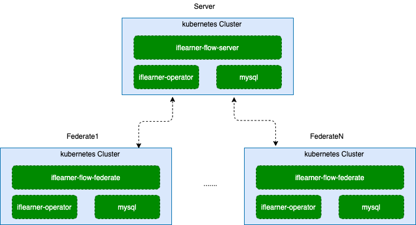
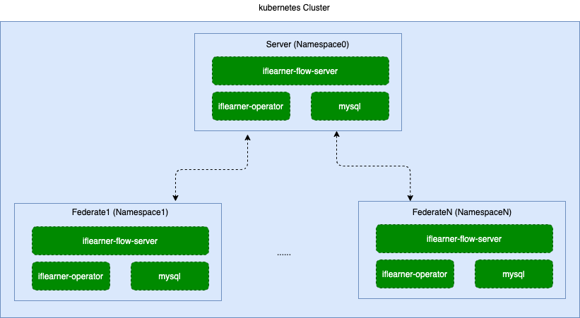

# 在kubernetes集群上搭建iflearner-flow

## 1. 总体介绍
### 1.1 系统介绍
Iflearner Flow是一个基于底层联邦学习框架Iflearner，针对横向联邦学习场景建模的多方联合任务安全调度平台。

### 1.2 组件说明
1. 服务端方

    | 组件           |版本           |  说明                                   |
    | -------------- | --------- | -------------------------------------- |
    | kubernetes          | 1.18      | 容器编排集群，flow-server依赖 |
    | mysql          | 5.7      | 数据存储，flow-server依赖 |
    | ifleaner-flow-server          | 0.1.0     | server侧调度组件 |
    | ifleaner-operator          | 0.0.1     | kubernetes crd的控制器 |

2. 联邦方

    | 组件           |版本           |  说明                                   |
    | -------------- | --------- | -------------------------------------- |
    | kubernetes          | 1.18      | 容器编排集群，flow-server依赖 |
    | mysql          | 5.7      | 数据存储，flow-server依赖 |
    | ifleaner-flow-federate          | 0.1.0     | federate侧调度组件 |
    | ifleaner-operator          | 0.0.1     | kubernetes crd的控制器 |

### 1.3 系统设计

[系统设计](../tutorial/system_arch_zh.md)

## 2. 详细设计
### 2.1 部署规划
 本示例为了便于演示，服务侧和联邦侧都只有一台主机，事实上依托于kubernetes，可以自由扩大每侧的集群规模。

1. 服务侧

    | IP地址                | 操作系统                | 主机配置 | 存储 | 部署模块                                                     |
    | --------------------- | ----------------------- | -------- | ---- | -------------------------------- |
    | 172.31.0.1 | CentOS 7.4 | 16C32G    | 100G | kubernetes、mysql、iflearner-flow-server、ifleaner-operator |

2. 联邦侧

    | 联邦              | IP地址                | 操作系统                | 主机配置 | 存储 | 部署模块                                                     |
    | --------------------- | --------------------- | ----------------------- | -------- | ---- | -------------------------------- |
    | 联邦1 | 172.31.0.2 | CentOS 7.4 | 16C32G, GPU卡一张(非必须)    | 100G | kubernetes、mysql、iflearner-flow-server、ifleaner-operator |
    | 联邦2 | 172.31.0.3  | CentOS 7.4 | 16C32G, GPU卡一张(非必须)    | 100G | kubernetes、mysql、iflearner-flow-federate、ifleaner-operator |
    > 这里只演示了只有两个联邦的场景，可以自由扩充

### 2.2 主机资源和操作系统要求
| **类别** | **说明**                                                     |
| -------- | ------------------------------------------------------------ |
| 主机配置 | 不低于8C、16G、50G，千兆网卡、最好配置GPU卡进行训练加速                                    |
| 操作系统 | CentOS linux 7.4及以上                 |
| 文件系统 | 1、持久化数据盘默认挂载在/data目录下。  2、根目录空闲空间不低于20G。 |
| 系统参数 | 1、文件句柄数不低于65535。  2、用户进程数不低于65535。     |

### 2.3 网络要求
| 类别         | 说明                                                         |
| ------------ | ------------------------------------------------------------ |
| 防火墙策略   | 1、防火墙设备需要支持长连接和需要对连接数无限制。 |

## 3. 项目部署(真实场景下部署)
在真实场景下，各方都是隔离的，需要各自部署一套kubernetes集群。

### 3.1 部署示意图

### 3.2 服务侧部署
#### 3.2.1 部署kubernetes
推荐一个极简的一键部署方式[sealos](https://www.sealos.io/zh-Hans/docs/Intro)
> 当前支持版本为1.18

#### 3.2.2 部署iflearner-operator
参见[iflearner-operator](https://github.com/iflytek/iflearner-operator)

#### 3.2.3 部署iflearner-flow-server
我们提供了一个极简的部署方式, 请参阅[flow-server部署和运维指南](https://github.com/iflytek/iflearner-flow/blob/main/deploy/in_standalone_kubernetes/iflearner_flow_server/README_zh.md)

### 3.3 联邦侧部署
每个联邦方执行步骤一致，下述为单个联邦方下的执行步骤

#### 3.3.1 部署kubernetes
推荐一个极简的一键部署方式[sealos](https://www.sealos.io/zh-Hans/docs/Intro)
> 当前支持版本为1.18

#### 3.3.2 部署iflearner-operator
参见[iflearner-operator](https://github.com/iflytek/iflearner-operator)

#### 3.3.3 部署iflearner-flow-federate
我们提供了一个极简的部署方式, 请参阅[flow-federate部署和运维指南](https://github.com/iflytek/iflearner-flow/blob/main/deploy/in_standalone_kubernetes/iflearner_flow_federate/README_zh.md)

## 4. 项目部署(测试验证场景下部署)
在测试验证场景下，我们可以复用一套kubernetes集群，在同一个集群下去做测试验证。

### 4.1 部署示意图

