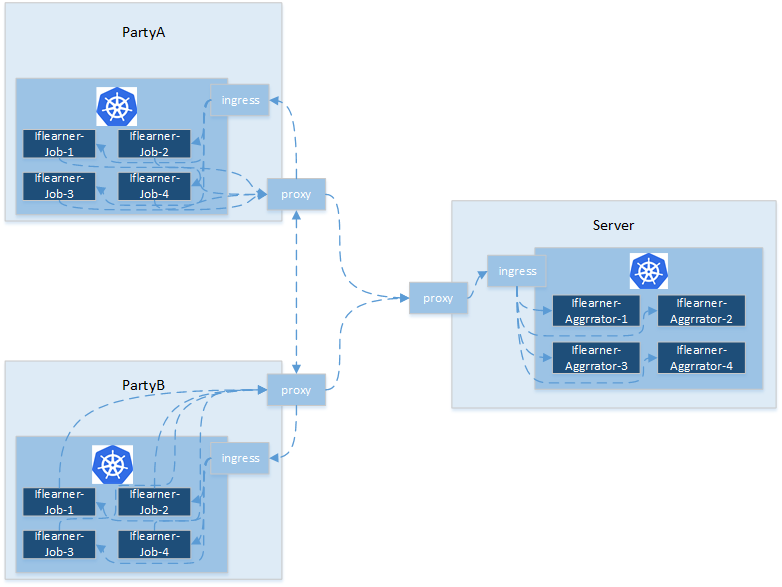
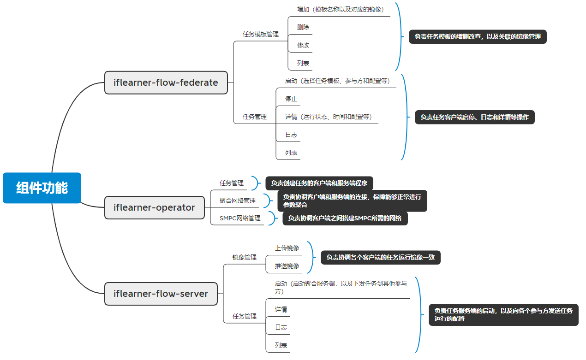

# Iflearner Flow Design

## Summary

There are two roles in horizontal federated learning, server and participant. The architecture is as follows: 

Each party should train the model with its own local data and upload the model parameters or gradients to the server every epoch. When the server receives data from the parties, the server handles the aggregation operation. The server then sends the aggregated data to each party, and each party starts a new epoch of training.

## Component

Iflearner Flow has two components, iflearner-flow-server and iflearner-flow-federate. These components run on kubernetes and depend on the iflearner-operator component. The detailed functions are as follows:

## Implement

There are four main source codes in the python directory:

- iflearner_flow_client

    - sdk

        It provides a python package of http API for easy development and integration.

    - cli

        It is a command tool, basesd on sdk.

- iflearner_flow_federate

    Client source code

- iflearner_flow_server

    Server source code

- iflearner_job

    It encapsulates operations on the kubernetes IflearnerJob object, which is provided by iflearner-operator.
