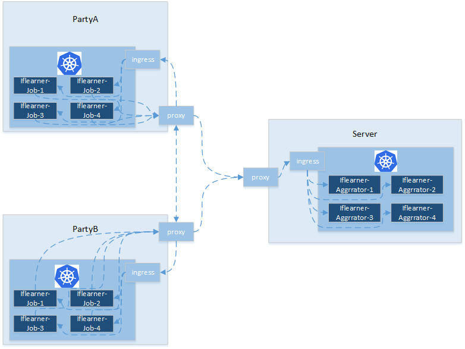
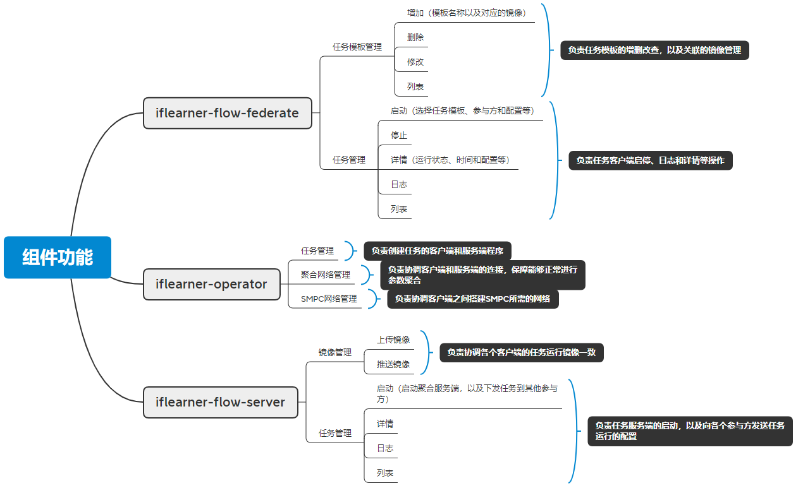

# Iflearner Flow设计文档

## 概述

横向联邦学习可分为两种角色，联邦服务端和联邦参与方，架构图如下：

参与方用自己本地的数据训练模型，然后在每轮训练中上传模型参数或者梯度到服务端。服务端接收参与方上传上来的数据，并进行聚合操作，然后再将聚合后的数据下发给参与方。参与方随后开启新一轮的训练。

## 组件

Iflearner Flow分为服务端（iflearner-flow-server）和客户端（iflearner-flow-federate）两个组件，组件均可运行在kubernetes之上，并依赖iflearner-operator组件，具体的功能如下：

## 实现

在python目录下有四个源代码的目录：

- iflearner_flow_client

    - sdk

        提供了对应http接口的python包，方便开发集成。

    - cli

        基于sdk，提供了命令行工具。

- iflearner_flow_federate

    客户端的代码

- iflearner_flow_server

    服务端代码

- iflearner_job

    封装了对kubernetes IflearnerJob对象的操作。（IflearnerJob对象由iflearner-operator提供）
